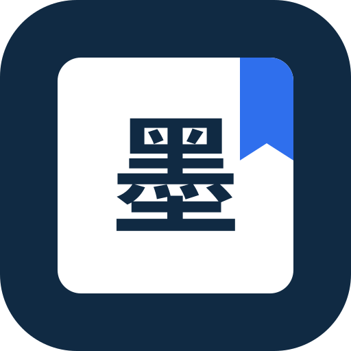
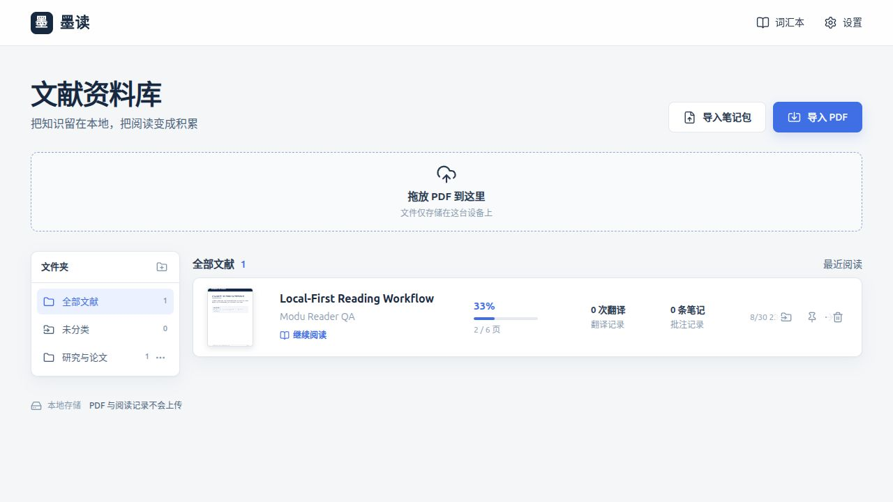
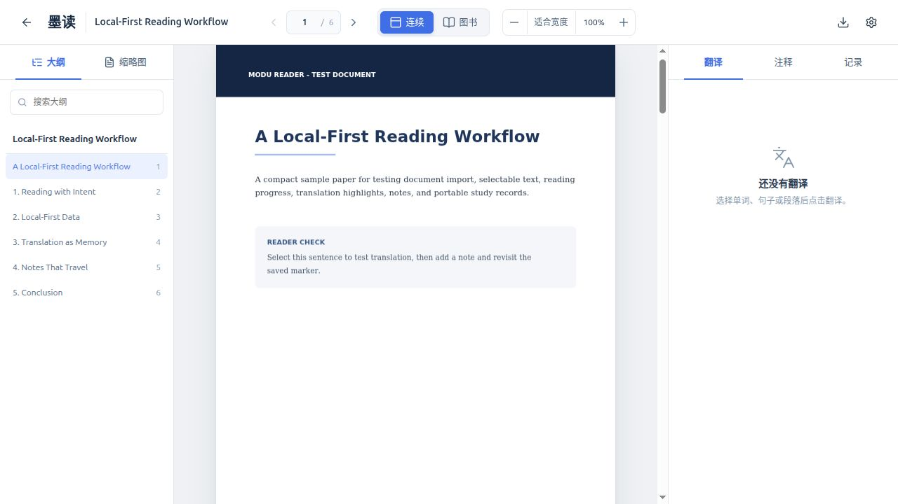
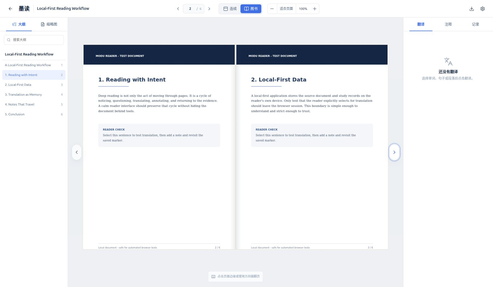

  

<h1 align="center">墨读</h1>

<strong>本地优先的 PDF 深度阅读器</strong>

  把论文、教材和电子书留在自己的设备上，把翻译、批注与生词沉淀成可以反复回看的知识。

  <a href="https://github.com/HZZ2Z/Updf/releases">查看版本发布</a>
  ·
  <a href="#获取墨读">获取墨读</a>
  ·
  <a href="#本地优先不是一句口号">隐私说明</a>

墨读为长时间阅读而设计。文献可以按文件夹整理、手动拖动排序和快速续读；阅读进度、翻译数量与批注数量集中显示，所有资料默认保存在本机。资料库顺序由你决定，不会因为最近阅读时间而自动跳动。

1.1.1 恢复 PDF 真实缩略图，简化资料库操作，并加入密钥安全持久化、阅读现场恢复与单词自动收集。

## 两种阅读体验

### 连续阅读

单页纵向滚动，适合论文、讲义和需要频繁查阅的技术文献。缩略图、页码与缩放控制始终触手可及，长文档只渲染视口附近页面。

### 图书模式

宽屏下以双页展开呈现，支持点击页边、拖动页角和方向键翻页，并带有纸张阴影与翻页动画；窗口较窄时自动切换为单页翻动。

## 从阅读到积累

- **选区翻译**：选择单词、句子或段落后再决定是否翻译，支持 DeepSeek 与 Google Cloud Translation。相同内容会命中本地缓存，避免重复消耗额度。
- **高亮与注释**：翻译结果以蓝色标记保留，普通高亮提供多种颜色；注释可以绑定选区或页面位置，并以可折叠标题呈现。
- **词汇复习**：单词和短语可以进入词汇本，保留上下文、文献来源和页码，并通过卡片模式标记掌握状态。
- **可移植记录**：翻译、批注和词汇可以导出为阅读记录包，也可以生成 Markdown 笔记或 CSV 词汇表。

## 本地优先，不是一句口号

- PDF、阅读进度、翻译、高亮、注释与词汇保存在本机 IndexedDB。
- PDF 本身不会上传；只有你选中并明确点击“翻译”的文字会发送给所选翻译服务。
- DeepSeek 与 Google API Key 在桌面端由系统安全存储加密保存，不写入资料库、日志或导出文件。
- 分享阅读记录时不包含原 PDF，接收者需要持有指纹完全相同的文献。

## 获取墨读

当前稳定版本为 **1.1.1**，桌面版本支持 Linux x86_64。

在 [Releases](https://github.com/HZZ2Z/Updf/releases) 中可以获取对应版本：

- **AppImage**：单文件版本，已包含 Electron、Node.js、Next.js 与应用依赖；无需安装 Node.js 或 npm，授予可执行权限后即可运行。
- **deb**：适用于 Debian、Ubuntu 及其衍生发行版，安装时由系统处理必要的桌面基础组件。

首次运行桌面版时，墨读会询问是否设为 PDF 默认应用；选择后即可从文件管理器双击 PDF 直接打开。也可以选择“以后再说”，随时在“设置 → PDF 默认应用”中完成设置。应用不会在未确认时修改系统默认打开方式。

桌面版会在启动后于后台检查新版本，但不会在阅读期间擅自下载或安装。发现新版本时，资料库会显示轻量提示；你可以在“设置 → 应用更新”中查看版本说明、下载更新，并在准备好后手动重启安装。

如果使用项目源码包，也可以在 Linux 文件管理器中双击 `启动墨读.desktop` 启动本地版本。

## 当前范围

墨读目前面向最新版 Linux 桌面环境及 Chrome/Edge。扫描 PDF 可以阅读、缩放并添加页面注释，但暂不包含 OCR；账户、云同步、在线协作、PDF 内容编辑与 DRM 文档不在 1.1.1 范围内。Windows 桌面版将在后续版本提供。
